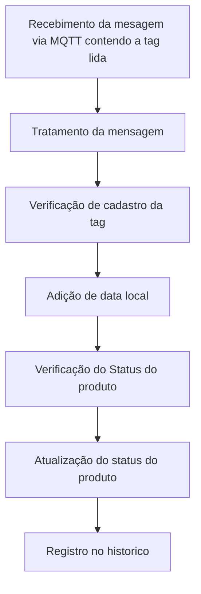

Repositorio contendo todos os arquivos de configuração, palette e desenvolvimento do node-red para recebimento tratamento e disposição dos dados de medição de consumo ao banco dde dados.

<div> </div>


## <a name="mode-de-execucao"><a/>Modo de execução

Para executar essas configurações no Node-RED, é preciso ter instalado o Node-RED e o Postgres via Docker.

**Atualização do sistema**

```
sudo apt-get update && apt-get upgrade -y
```


**Entre no modo de navegação root**
```
sudo su
```

**Navegue até a pasta do node-red**
```
cd /home/pi/node-red
```

**Inicialize o repositorio**
```
git init
```

**Adicione o repositorio remoto**
```
git remote add origin https://github.com/R-FlyD/Node-red.git
```

**Limpe o repositorio local**
```
git clean -f
```

**Pegue as alterações do repositorio remoto**
```
git pull -f origin main
```
	
pronto basta entrar com suas credenciais e logo as configurações serão baixadas.

## <a name=“funcionamento-node-red”><a/>Funcionamento Node-Red

Node-RED é uma plataforma open-source baseada em Node.js para desenvolver aplicativos IoT (Internet of Things) e integração de sistemas. Ele permite que os usuários criem fluxos de trabalho visualmente, conectando nós pré-construídos de uma vasta biblioteca, chamados de nodes.

Os usuários podem criar um fluxo de trabalho usando uma interface gráfica de arrastar e soltar para conectar os nodes e criar uma lógica de programação. Os nodes podem ser usados para realizar ações como processamento de dados, controle de dispositivos, leitura e gravação em bancos de dados, envio e recebimento de dados via MQTT, HTTP, entre outros protocolos.

Os fluxos criados podem ser facilmente implantados em diferentes plataformas, incluindo nuvem, dispositivos locais e até mesmo em Raspberry Pi. Node-RED é altamente personalizável e extensível, permitindo que os usuários adicionem seus próprios nodes e personalizem os existentes para atender às suas necessidades.

Após a instalação, ao acessar a ferramenta você terá os seguintes componentes na tela.

- Lado esquerdo: Paleta com todos os Nodes (Nós) instalados.
- Centro: Ambiente de desenvolvimento. Onde ficam os Flows criados com suas automações baseado em nós.
- Lado direito: Você tem um conjunto de informações, área de ajuda, área de debug, configurações de layout.

<br>

> ### <a name=“ferramentas”><a/>Ferramentas

#### <a name=“nodes”><a/>Nodes

Nodes são os blocos de construção básicos do Node-RED, cada um representando uma função ou serviço específico. Os nodes são organizados em categorias, como entrada (input), saída (output), processamento (processing) e controle (function), e podem ser facilmente adicionados ao fluxo de trabalho arrastando e soltando da biblioteca de nodes.

<div align="center">
    <br>    
</div>

Os nodes incluem recursos como entrada de dados, conversão de dados, processamento de dados, saída de dados e controle de fluxo. Eles também podem ser personalizados e estendidos pelos usuários para atender às suas necessidades específicas.

#### <a name=“flows”><a/>Flows

Flows são o conjunto de nodes que formam o fluxo de trabalho em Node-RED. Os fluxos são criados arrastando e soltando os nodes na interface gráfica e conectando-os para criar uma lógica de programação visual. Os fluxos podem ser facilmente modificados, adicionando ou removendo nodes ou reorganizando sua conexão.

|<br> | <br> |
| :---: | :---: |

O Node-RED suporta a importação e exportação de fluxos, o que permite compartilhar e reutilizar fluxos entre usuários. Além disso, o Node-RED inclui um recurso de versionamento de fluxo que permite salvar e recuperar versões anteriores do fluxo.

#### <a name=“subflows”><a/>Subflows

Subflows são fluxos menores que podem ser encapsulados e reutilizados em um fluxo maior. Eles são úteis quando um conjunto de nodes é usado várias vezes em diferentes fluxos, permitindo que o usuário crie um subfluxo separado que pode ser adicionado a outros fluxos.

<div align="center">
    <br> 
</div>

Os subflows funcionam como nodes, mas contêm seu próprio conjunto de nodes e conexões. Eles podem ser facilmente criados arrastando e soltando nodes e conexões para um novo fluxo e salvando-o como um subfluxo. Os subfluxos são então adicionados ao fluxo principal arrastando e soltando como um único node.

## <a name=“implementação”><a/>Implementação

<div> </div>


Inicialmente, temos todos os nodes separados em dois fluxos: o **Receive Data** e o **Postgres**. No primeiro fluxo, o **Receive Data**, temos o processo de recebimento, tratamento e adição de informações. Já no segundo, o **Postgres**, temos os nodes responsáveis pela comunicação entre o Node-RED e o banco de dados PostgreSQL. 



É importante ressaltar que em ambos os fluxos são utilizados subflows para simplificar o processo. Abaixo, seram destacados suas funcionalidades.

>### <a name=“receive-data”><a/>Receive Data

<div align="center">
    <br> 
</div>

O fluxo de dados no receive se da na aquisição dos dados que veem via mqtt no subflow ***MQTT***, que posteriormente são tratados pelo subflow ***Tratamento da mensagem*** onde as mensagem são tratadas e posteriormente e adicionado a data no subflow ***Date***.

Logo abaixo temos uma mensagem que chega do medidor referente à corrente de fase A:

```json
{
  "packet": {
    "cmd" : "publish",
    "retain": false,
    "qos": 0,
    "dup" : false,
    "length" : "58",
    "topic" : "RFID",
    "payload": buffer[42]
  }
  "client":{}
}
```

Percebe-se que esta mensagem, além de conter o payload no formato buffer, contém também todos os dados do MQTT, como configuração de tópico, subtop, entre outros, sendo simplificada para se tornar:
```json
{
  "id" : "publish",
  "topic" : "RFID",
  "tag": 1902835DE
}
```
>### <a name=“postgres”><a/>Postgres

<div align="center">
    <br>
</div>

O fluxo do Postgres funciona como uma ferramenta de conexão entre o Node-RED e o banco de dados, permitindo diversas interações com o banco. Por exemplo, é possível verificar o cadastro de uma determinada tag, atualizar o status de um produto, atualizar o historio de possicionamento de um produto e Manter a sincronização da usuabilidade da antena de acordo com o site.

Dentro desse fluxo, temos vários subfluxos que facilitam o trabalho com o banco de dados. Por exemplo, o subfluxo ***Verifica cadastro*** faz requisições ao banco remoto para averiguar informações. O subfluxo ***Atualiza Checked*** que é responsável por alterar de tempos em tempos o status de todos os produtos para falso, a fim de acarretar uma nova leitura utilizando o drone, e temos também o subfluxo ***sincronismo Rele*** que de tempos envia uma mensagem para o tópico RFID a fim de se comunicar com o NoceMCU e manter atualizado nele a informação de que a antena deva funcionar como carregador por indução ou leitor RFID, o valor enviado ao NodeMCU é pego diretamente do banco de dados.